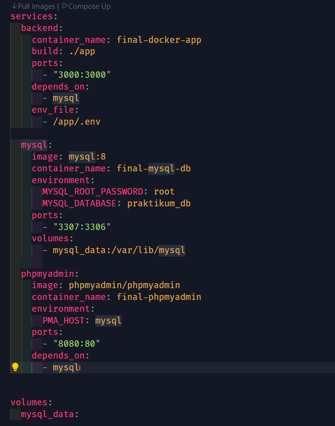
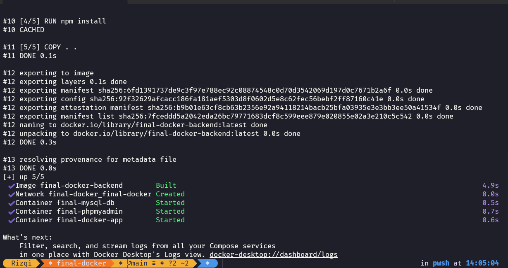
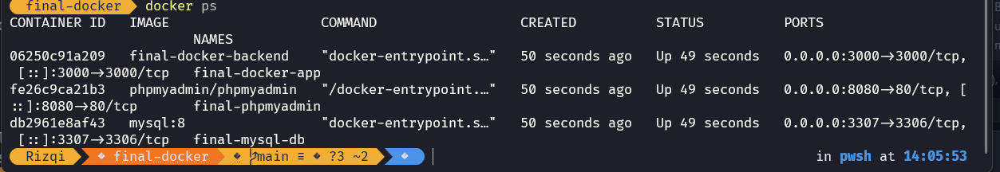
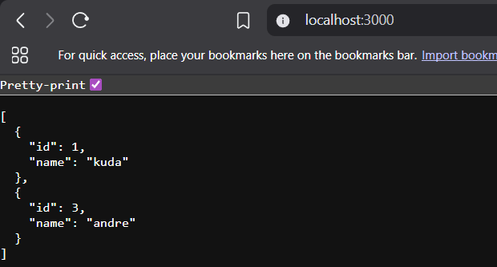
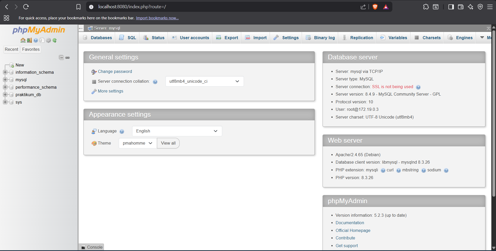
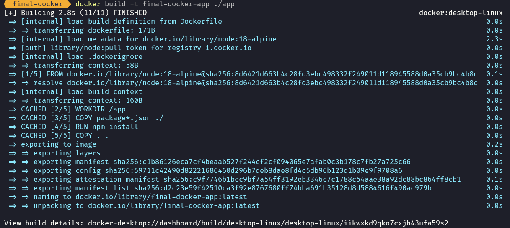
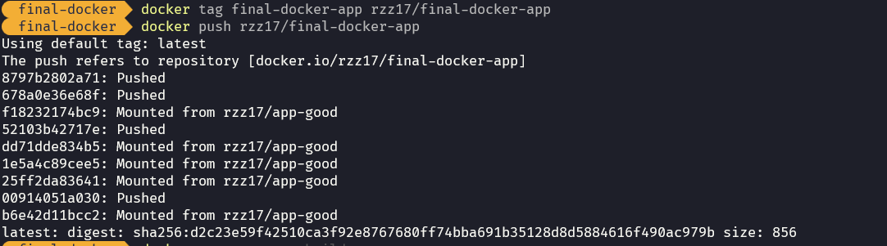

# Laporan Hasil Praktikum: Final Project Aplikasi Berbasis Container

## Identitas Mahasiswa

- **Nama:** Muhamad Rizqi Assabiquunal Awwalun
- **NIM:** 2415354060
- **Kelas/Rombel:** TRPL D
- **Tanggal Praktikum:** 20 Mei 2026

---

## Teknologi & Tools yang Digunakan

- **Sistem Operasi:** Windows 11
- **Containerization:** Docker & Docker Compose
- **Bahasa Pemrograman / Framework:** Node.js, Express.js
- **Database:** MySQL 8
- **Tools Lain:** VS Code, Git, Postman, phpMyAdmin

---

## Langkah-Langkah Praktikum & Dokumentasi

### Langkah 1: Membuat Aplikasi Node.js dan Dockerfile

Pada langkah ini, saya memulai dengan menginisialisasi project Node.js dan menginstal dependensi yang diperlukan, kemudian membuat aplikasi REST API CRUD serta `Dockerfile`.

**Inisialisasi project Node.js:**
```bash
# Masuk ke folder app
cd app

# Inisialisasi project Node.js
npm init -y

# Install dependensi yang dibutuhkan
npm install express mysql2 dotenv
```


**Dokumentasi/Screenshot:**


**File yang dibuat:**
- **`app/app.js`** — Aplikasi Express dengan endpoint CRUD (`GET /`, `GET /users/:id`, `POST /users`, `PUT /users/:id`, `DELETE /users/:id`) yang terhubung ke MySQL menggunakan library `mysql2` dan `dotenv`.
- **`app/package.json`** — Konfigurasi dependensi Node.js (`express`, `mysql2`, `dotenv`) yang dihasilkan dari perintah `npm init -y` dan `npm install`.
- **`app/.env`** — File konfigurasi environment untuk koneksi database (`DB_HOST`, `DB_NAME`, `DB_USER`, `DB_PASSWORD`, `APP_PORT`).
- **`app/Dockerfile`** — File untuk membangun _image_ Docker aplikasi.


```dockerfile
FROM node:18-alpine

WORKDIR /app

COPY package*.json ./

RUN npm install

COPY . .

EXPOSE 3000

CMD ["npm", "start"]
```

**Dokumentasi/Screenshot:**


---

### Langkah 2: Membuat File docker-compose.yml

Pada langkah ini, saya membuat file `docker-compose.yml` untuk mengatur dan mengelola tiga _service_ yang saling terhubung dalam satu _network_ khusus:

1. **backend** — Aplikasi Node.js yang di-*build* dari folder `./app`, berjalan di port `3000:3000`.
2. **mysql** — Database MySQL 8 dengan username `root`, password `root`, database `praktikum_db`, menggunakan port `3307:3306` (host : container) dengan volume persisten `mysql_data`.
3. **phpmyadmin** — Antarmuka web untuk mengelola database MySQL, berjalan di port `8080:80`, terhubung ke service `mysql`.

Seluruh service dihubungkan melalui **custom network** bernama `final-docker` dengan driver `bridge` agar dapat berkomunikasi satu sama lain menggunakan nama service sebagai hostname. Pada service **mysql** juga ditambahkan **healthcheck** untuk memastikan MySQL benar-benar siap menerima koneksi sebelum service **backend** mulai berjalan.

```yaml
services:
  backend:
    container_name: final-docker-app
    build: ./app
    ports:
      - "3000:3000"
    depends_on:
      mysql:
        condition: service_healthy
    env_file:
      - /app/.env
    networks:
      - final-docker

  mysql:
    image: mysql:8
    container_name: final-mysql-db
    environment:
      MYSQL_ROOT_PASSWORD: root
      MYSQL_DATABASE: praktikum_db
    ports:
      - "3307:3306"
    volumes:
      - mysql_data:/var/lib/mysql
    healthcheck:
      test: ["CMD", "mysqladmin", "ping", "-h", "localhost"]
      interval: 5s
      timeout: 3s
      retries: 10
      start_period: 30s
    networks:
      - final-docker
      
  phpmyadmin:
    image: phpmyadmin/phpmyadmin
    container_name: final-phpmyadmin
    environment:
      PMA_HOST: mysql
    ports:
      - "8080:80"
    depends_on:
      - mysql
    networks:
      - final-docker

volumes:
  mysql_data:

networks:
  final-docker:
    driver: bridge
```


**Dokumentasi/Screenshot:**


---

### Langkah 3: Build dan Menjalankan Container dengan Docker Compose

Setelah semua file siap, saya menjalankan perintah `docker compose` untuk membangun _image_ dan menjalankan seluruh _container_ secara bersamaan.

```bash
# Build image dan jalankan semua service di background
docker compose up -d --build
```

Perintah di atas akan:
1. Membangun _image_ Docker untuk service **backend** berdasarkan `Dockerfile`.
2. Mengunduh _image_ **mysql:8** dan **phpmyadmin/phpmyadmin** dari Docker Hub (jika belum ada).
3. Menjalankan ketiga _container_ secara berurutan dengan mekanisme `depends_on`, di mana **backend** menunggu **mysql** hingga statusnya _healthy_ berkat konfigurasi `healthcheck`.
4. Membuat volume `mysql_data` untuk menyimpan data database secara persisten.


**Dokumentasi/Screenshot:**


---

### Langkah 4: Verifikasi Container dan Pengujian API

Setelah semua _container_ berjalan, saya melakukan verifikasi dan pengujian.

**Cek status container:**
```bash
docker ps
```



**Pengujian Endpoint API menggunakan Postman:**

| Method | Endpoint | Deskripsi |
|--------|----------|-----------|
| GET | `http://localhost:3000/` | Melihat semua data users |
| GET | `http://localhost:3000/users/:id` | Melihat data user berdasarkan ID |
| POST | `http://localhost:3000/users` | Menambahkan user baru (body: `{"name": "..."}`) |
| PUT | `http://localhost:3000/users/:id` | Mengupdate data user (body: `{"name": "..."}`) |
| DELETE | `http://localhost:3000/users/:id` | Menghapus data user |

**Contoh pengujian POST (menambahkan user baru):**
```bash
curl -X POST http://localhost:3000/users \
  -H "Content-Type: application/json" \
  -d '{"name": "Rizqi"}'
```

**Hasil:**
```json
{
  "id": 1,
  "name": "Rizqi"
}
```

**Akses phpMyAdmin:**
Kunjungi `http://localhost:8080` di browser, login dengan user `root` dan password `root` untuk melihat data di database `praktikum_db` melalui antarmuka web.

**Dokumentasi/Screenshot:**



---

### Langkah 5: Build dan Push Image ke Docker Hub

Setelah aplikasi berhasil diuji secara lokal, langkah selanjutnya adalah membuat _image_ Docker dari aplikasi **backend** dan mengunggahnya ke Docker Hub agar dapat dibagikan atau dideploy di lingkungan lain.

**1. Login ke Docker Hub**
```bash
docker login
```
Masukkan **username** dan **password** akun Docker Hub saat diminta.

**2. Build image backend**
```bash
docker build -t final-docker-app ./app
```

**Dokumentasi/Screenshot:**



Perintah ini membangun _image_ dari `Dockerfile` yang berada di dalam folder `app`.

**3. Tag image dengan username Docker Hub**
```bash
docker tag final-docker-app <username>/final-docker-app:v1.0
```
> Ganti `<username>` dengan username Docker Hub Anda.

**Contoh:**
```bash
docker tag final-docker-app madedianpp/final-docker-app:v1.0
```

**4. Push image ke Docker Hub**
```bash
docker push <username>/final-docker-app:v1.0
```

**Contoh:**
```bash
docker push rzz17/final-docker-app:v1.0
```

**Dokumentasi/Screenshot:**



**5. Verifikasi di Docker Hub**
Buka [https://hub.docker.com/repositories](https://hub.docker.com/repositories) di browser, lalu pastikan repository `<username>/final-docker-app` sudah muncul dengan tag `v1.0`.

**Catatan:** Hanya image aplikasi **backend** (Node.js) yang perlu di-push. Image MySQL dan phpMyAdmin sudah tersedia secara publik di Docker Hub.

**Dokumentasi/Screenshot:**


---

## Kesimpulan


Praktikum ini berhasil membuat aplikasi REST API CRUD berbasis container dengan menggunakan Docker Compose yang terdiri dari tiga service: aplikasi Node.js (backend), database MySQL, dan phpMyAdmin. Dengan Docker Compose, seluruh service dapat dijalankan secara terintegrasi hanya dengan satu perintah (`docker compose up -d`). Data pada MySQL juga tersimpan secara persisten menggunakan volume Docker. Aplikasi dapat diakses melalui port 3000 untuk API, dan phpMyAdmin melalui port 8080 untuk manajemen database secara visual.
